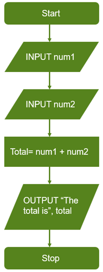
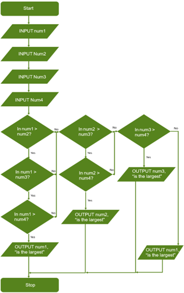
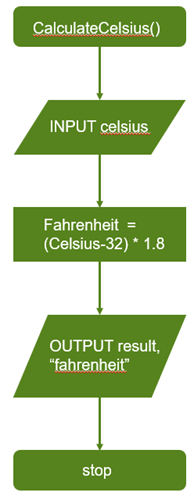
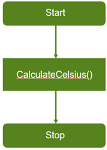
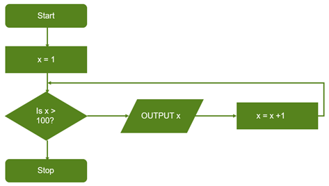
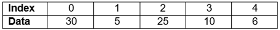

# Unit 9.3 Programming {#unit-9.3-programming}

Outline of topic:

In this unit, learners will implement algorithms using pseudocode, flowcharts and a text-based programming language. They will explore further programming features in a text-based language to extend their learning from earlier stages. This will include the implementation of count-controlled loops.

Learners will need to make use of pre-existing subroutines to write programs, and will be introduced to string manipulation features, including length, uppercase and lowercase. They will also be introduced to accessing data from arrays.

Learners will also explore the use of compilers and interpreters, including their role in the translation of program code, and the specific features of each.

Recommended prior knowledge:

Learners should have the following prior knowledge:

- Follow a flowchart or pseudocode algorithm that uses conditional statements

- Explain the purpose of a 1-dimensional array

- Know how to develop text-based programs with conditional (selection) statements

- Follow a flowchart or pseudocode algorithm that uses loops

- Understand and use iteration statements, limited to count-controlled loops, presented as either a flowchart or pseudocode

- Know that computers represent data in binary (0, 1)

Language:

- Iteration

- Count-controlled loop

- Subroutine

- Lowercase / Uppercase

- String length

- Array

- Index

- String manipulation

- Translator

- Compiler / Interpreter

- Executable file

<table>
<caption>Suggested teaching activitiesUnder the header row, the rows give suggested teaching activities and resources, along with their associated learning objectives and additional notes.</caption>
<colgroup>
<col style="width: 20%" />
<col style="width: 45%" />
<col style="width: 34%" />
</colgroup>
<thead>
<tr class="header">
<th><strong>Learning objectives</strong></th>
<th><strong>Suggested teaching activities and resources</strong></th>
<th><strong>Additional notes</strong></th>
</tr>
</thead>
<tbody>
<tr class="odd">
<td><strong>9CT.03</strong> Know how to create algorithms using flowcharts and pseudocode.</td>
<td>
Introduce this unit by checking learners’ prior knowledge of flowcharts and pseudocode. Ask:

<blockquote>

<em>What are the standard flowchart shapes?</em>

<em>What does an arrow in a flowchart show?</em>

<strong>Answer:</strong> The direction of flow

<em>What rules does pseudocode have?</em>

<strong>Answer:</strong> There are no set rules, but standard programming symbols should be used instead of English-style sentences

<em>When are flowcharts and pseudocode used?</em>

<strong>Answer:</strong> When designing algorithms and solutions to problems

</blockquote>

Display a flowchart, for example:

Ask learners to convert this flowchart into pseudocode. They should compare their response with a partner and discuss any differences. They should consider if these differences are valid or whether there are errors in one, or both, pseudocode algorithms.

Repeat this activity with flowcharts of increasing complexity, for example:

<ul>
<li>
by introducing multiple operations
</li>
<li>
then introducing selection statements.
</li>
</ul>

Give learners a pseudocode algorithm, for example:

<blockquote>

number1 = input("Enter a number")

number2 = input("Enter a number")

number3 = input("Enter a number")

number4 = input("Enter a number")

if(number1 &gt; number2 and number1 &gt; number2 and number1 &gt; number3 and number1 &gt; number4):

print(number1, " is the largest")

elif(number2 &gt; number3 and number2 &gt; number4):

print(number2, " is the largest")

elif(number3 &gt; number4):

print(number3, " is the largest")

else:

print(number4, " is the largest")

</blockquote>

Ask them to present this pseudocode as a flowchart. They should then compare their responses with a partner and identify any errors, or to determine if they have different, but still accurate, flowcharts.

Give each pair the description of a problem, for example:

<blockquote>

<em>Freya wants to work out how much money she will have left at the end of the month. She needs to enter the amount of pocket money she gets each week for 4 weeks. She then needs to enter the 5 products she has bought and how much they cost. The program then needs to output how much money she will have left.</em>

</blockquote>

In pairs, ask learners to write a pseudocode algorithm to solve this problem. Each pair should then swap their solution with another, and test whether they work. To support their testing, provide learners with some input data, for example:

<ul>
<li>
the amount of pocket money received each week
</li>
<li>
a list of items and their costs.
</li>
</ul>

Hold a class discussion to summarise this task. This discussion could be prompted by the following questions:

<blockquote>

<em>Did your solutions solve the problems?</em>

<em>Did you find any errors?</em>

<em>What were the errors?</em>

<em>How did you solve them?</em>

<em>How did you test whether your solution solved the problem?</em>

</blockquote>

<strong>Resources:</strong>

<ul>
<li>
Set of flowcharts for learners to convert to pseudocode
</li>
<li>
Set of pseudocode algorithms for learners to convert to flowcharts
</li>
<li>
Set of problems showing algorithms
</li>
</ul></td>
<td>
There are a range of possible standard flowchart symbols, the ones listed here are those that match the ones used in the Cambridge International qualifications:

<ul>
<li>
Rectangle for process
</li>
<li>
Rectangle with rounded corners for start and stop
</li>
<li>
Parallelogram for input and output
</li>
<li>
Diamond for selection.
</li>
</ul>

The matching pseudocode for this flowchart would be:

num1 = input("Enter a number")

num2 = input("Enter a number")

total = num1 + num2

print("The total is ", total)

A flowchart solution to this algorithm would be:

A pseudocode solution to this problem would be:

<blockquote>

week = input("Enter the amount of money you get a week")

totalMoney = week * 4

product1 = input("Enter the cost of the first item you bought")

product2 = input("Enter the cost of the second item you bought")

product3 = input("Enter the cost of the third item you bought")

product4 = input("Enter the cost of the fourth item you bought")

totalLeft = totalMoney - product1 - product2 - product3 - product4

print("You will have ", totalLeft, " money left")

</blockquote></td>
</tr>
<tr class="even">
<td><strong>9CT.04</strong> Know how to use predefined sub-routines in flowcharts or pseudocode.</td>
<td>
Display the term ‘sub-routine’ and ask a learner to explain their understanding of its meaning. Ask other learners to add to the answer until a suitable definition has been achieved. Elicit that:

<ul>
<li>
a sub-routine is a self-contained program that that can be called from other programs
</li>
<li>
sub-routines can be used multiple times in an algorithm and can be used across different algorithms.
</li>
</ul>

Display a list of instructions for actions that include a subroutine, for example:

<blockquote>

Define: Action 1 = clap 3 times, jump twice, clap 3 times

Action 2 = turn around three times, clap 10 times

</blockquote>

Ask learners to follow these sub-routines, by calling out the following sequence of instruction:

<blockquote>

Stand up

Action 2

Action 1

Sit down

Stand up

Action 1

Action 2

Action 1

Sit down

</blockquote>

Hold a class discussion to determine learners’ understanding of what they have done during this activity. Ask:

<blockquote>

<em>What did you do for Action 1?</em>

<em>How did you know what you had to do?</em>

<em>Why was it easier to write Action 1 instead of 'clap 3 times, jump twice, clap 3 times' each time?</em>

</blockquote>

Remind learners that these are subroutines and help them to recall the definition that was agreed earlier in the activity. Explain that a sub-routine is:

<blockquote>

A set of commands that is given an identifier and can be called from anywhere in an algorithm.

</blockquote>

Elicit that using subroutines means that:

<ul>
<li>
you do not need to write the same code every time it is used
</li>
<li>
each small programme or algorithm only has to be written once but can be used many times within a larger programme or algorithm.
</li>
</ul>

Display a flowchart subroutine that has already been written, for example a subroutine that converts Celsius to Fahrenheit:

Also display a flowchart that makes use of the subroutine, for example:

Ask learners to work in pairs to follow the algorithm. Ask one pair to demonstrate the steps they followed, by explaining which instruction they followed.

Give learners another flowchart, for example for a different conversion. Ask them to draw a flowchart that calls this flowchart as a subroutine.

Display a pseudocode subroutine, for example:

<blockquote>

subroutine addition()

firstNumber = input("Enter the first number")

secondNumber = input("Enter the second number")

result = firstNumber + secondNumber

print(firstNumber, " + ", secondNumber, " = ", result)

endsubroutine

</blockquote>

Now provide a program that uses this subroutine, for example:

<blockquote>

answer = input("Do you want to add two numbers together?")

if(answer == "yes"):

addition()

else:

print("Program exiting")

</blockquote>

In pairs, ask learners to follow this program by entering different data, for example:

<ul>
<li>
"yes", 2, 3
</li>
<li>
"yes", 1, 19
</li>
<li>
"no".
</li>
</ul>

Provide each pair with pseudocode subroutines for other mathematical operations, for example subtraction and multiplication, etc. Ask them to extend the above pseudocode program by allowing the user to input which mathematical calculation to follow, and then call the appropriate subroutine.

Summarise learner's work by asking

<blockquote>

<em>What is a subroutine?</em>

<strong>Answer:</strong> A section of code with a name that can be called from another program.

<em>How do you call a subroutine in a flowchart or pseudocode?</em> <strong>Answer:</strong> Use its identifier.

</blockquote>

<strong>Resources:</strong>

<ul>
<li>
Set of instructions to follow including one or more subroutines
</li>
<li>
Flowcharts that use subroutines
</li>
<li>
Pseudocode that use subroutines
</li>
<li>
Algorithms in flowchart or pseudocode that include pre-written subroutines
</li>
</ul></td>
<td>
"yes", 2, 3 would give the output: "2 + 3 = 5"

"yes", 1, 19 would give the output: "1 + 19 = 20"

"no" would give the output "Program exiting"

A subroutine for subtraction could be:

subroutine subtraction()

firstNumber = input("Enter the first number")

secondNumber = input("Enter the second number")

result = firstNumber - secondNumber

print(firstNumber, " - ", secondNumber, " = ", result)

endsubroutine
</td>
</tr>
<tr class="odd">
<td>
<strong>9CT.06</strong> Understand and use iteration statements, limited to count-controlled loops, presented as either flowcharts or pseudocode.

<strong>9CT.09</strong> Combine multiple constructs (sequence, selection, count controlled iteration) to write algorithms as flowcharts or pseudocode.

<strong>9P.03</strong> Know how to develop text-based programs with count-controlled loops.
</td>
<td>
Gather learner's existing knowledge of count-controlled loops by asking the following questions:

<blockquote>

<em>What is iteration?</em>

<strong>Answer:</strong> Code that repeats multiple times.

<em>What is special about a count-controlled loop?</em>

<strong>Answer:</strong> It runs a set number of times.

<em>What features do you find in a count-controlled loop?</em>

<strong>Answer:</strong> A variable, its start value and its end value.

</blockquote>

Provide learners with a problem that will require them to make use of a count-controlled loop, for example to output the numbers 1 to 100. In pairs, ask them to discuss how to solve the problem. One of each pair should draw a flowchart to solve the problem, and the other should write a pseudocode algorithm. The pairs then compare their ideas to see if they both perform the same function.

Introduce learners to the syntax for programming count-controlled loops in a text-based programming language. In Python, this is:

<blockquote>

for <em>variable</em> in range(<em>startvalue</em>, <em>endvalue +1</em>):

<em>code</em>

</blockquote>

Provide learners with a help sheet which details the format and example programs that use count-controlled loops. Support them to make their own notes so that they can refer to it when programming.

Ask learners to convert their pseudocode or flowchart into a program using a text-based program, using the sample programs on their help sheet for guidance.

Display a problem that requires the use of a count-controlled loop, for example:

<blockquote>

<em>a program needs a user to enter the cost of 20 items, and then output the total and the average.</em>

</blockquote>

Ask learners to write a solution to the problem in the text-based language.

Hold a class discussion to check learner’s confidence during this task. This discussion could be informed by the following questions:

<blockquote>

<em>Did your programs work first time?</em>

<em>If not, how did you find the error?</em>

<em>How did you correct that error?</em>

</blockquote>

<strong>Resources:</strong>

<ul>
<li>
Problems that require the use of count-controlled loops
</li>
<li>
Help sheet that provides the syntax for count-controlled loops in text-based language
</li>
</ul></td>
<td>
A pseudocode solution, that follows python syntax, would be:

for x in range (1, 101):

print(x)

In this example, ‘101; has been used because in python this would be where the loop stops. Other languages would stop at ‘100’, for example:

for x = 1 to 100

print(x)

next x

A flowchart solution would be:

</td>
</tr>
<tr class="even">
<td rowspan="3"><strong>9P.04</strong> Know how to access data from an array using a text-based language.</td>
<td>
Display an array as a table, for example:

Ask a series of questions to check learners’ understanding of this array, for example:

<blockquote>

<em>What data is in index 0?</em>

<strong>Answer:</strong> 30

<em>What is the result of the data in index 2 + the data in index 3?</em>

<strong>Answer:</strong> 35

<em>What will be output if the pseudocode statement OUTPUT(array[4]) is run?</em>

<strong>Answer:</strong> 6

</blockquote></td>
<td>
Most arrays start with index 0, learners will need reminding that the first element is in index 0, the second in index 1, etc.

Python does not have an inbuilt array data structure. Instead it uses lists that have similar functionality and can be used in place of arrays.
</td>
</tr>
<tr class="odd">
<td>
Display the syntax for accessing an array in a text-based language and talk through it. Provide learners with a print-out of the syntax or ask them to make their own notes. Learners’ notes should include:

<ul>
<li>
how to output the value
</li>
<li>
how to store it in a variable to perform other functions, for example to add to another number.
</li>
</ul></td>
<td>
Python syntax involves the array name, followed by square brackets with the index inside, for example:

<blockquote>

myArray[0]

</blockquote></td>
</tr>
<tr class="even">
<td>
In pairs, give learners a program that already has an array declared, with values inserted, for example:

<blockquote>

myArray = [1, 4, 5, 3, 15, 64, 27, 54]

</blockquote>

Give the pairs a list of questions that requires them to write code to produce an answer, for example:

<blockquote>

Output the second element in the array.

<strong>Solution:</strong> print(myArray[1])

Output the data in index 0 in the array.

<strong>Solution:</strong> print(myArray[0])

</blockquote>

Gradually increase the complexity of the questions, for example by requiring a combination of elements. Example questions include:

<ul>
<li>
Output the value in index 0 added to the value in index 5.
</li>
</ul>
<blockquote>

<strong>Solution:</strong>

print(myArray[0] + myArray[5])

<strong>or</strong>

firstNum = myArray[0]

secondNum = myArray[5]

total = firstNum + secondNum

print(total)

</blockquote>
<ul>
<li>
Add together all the elements in the array.
</li>
</ul>
<blockquote>

<strong>Solution:</strong>

print(myArray[1])

</blockquote>

For an additional challenge, the use of arrays can be combined with a count-controlled loop, for example:

<ul>
<li>
Use a count-controlled loop to output each of the array items in turn.
</li>
</ul>
<blockquote>

<strong>Solution:</strong>

for x in range(0, 8):

print(myArray[x])

</blockquote>

Give each pair a program that makes use of two arrays, for example one with text and one with numbers such as:

<blockquote>

numberArray = [10, 5, 22, 100, 55, 82, 1]

colourArray = ["red", "purple", "blue", "green"]

</blockquote>

Provide a set of questions to write code to produce answers that involve both arrays, for example:

<ul>
<li>
Output the third element in the number array with the second colour.
</li>
</ul>
<blockquote>

<strong>Solution:</strong>

print(numberArray[2], " ", colourArray[1])

</blockquote>

Hold a class discussion to review learners’ understanding of the programming that they have done during this activity. This discussion can include the following questions:

<blockquote>

<em>How do you access data in an array (list) in Python?</em>

<strong>Answer:</strong> The array’s identifier [index]

<em>What is the first index in an array?</em>

<strong>Answer:</strong> 0

<em>What types of bracket do you surround the index with?</em> <strong>Answer:</strong> In Python, square brackets are used.

</blockquote>

<strong>Resources:</strong>

<ul>
<li>
Array as a table with indexes and data.
</li>
<li>
Program with a numeric array, and list of questions for learners to write code
</li>
<li>
Program with two arrays (one numeric and one text-based), and a list of tasks that require learners to write code.
</li>
</ul></td>
<td>
This would then need further code adding to enable it to do something with the value, for example:

<ul>
<li>
to output it: print(myArray[0])
</li>
<li>
to store it and perform a calculation with it:
</li>
</ul>
<blockquote>

myVar = myArray[0] + 2

print(myVar)

</blockquote>

Some learners may identify that some languages start at 1. Also rounded brackets are used in some other programming languages.
</td>
</tr>
<tr class="odd">
<td rowspan="2"><strong>9P.05</strong> Know how to develop text-based programs using string manipulation, including length, upper case, and lower case.</td>
<td>
Display a set of words stored in variables, for example:

<blockquote>

word1 = "programming"

word2 = "MANIPULATION"

</blockquote>

Discuss the following questions:

<blockquote>

<em>How many letters are in word2?</em>

<em>What would the data in word1 look like if it was all in capitals?</em>

</blockquote>

Discuss the need for string manipulation by asking:

<blockquote>

<em>Why do you need to change any words entered into a computer?</em>

<strong>Answers could include:</strong>

</blockquote>
<ul>
<li>
to access only certain characters
</li>
<li>
to split an address
</li>
<li>
to check what has been entered.
</li>
</ul>
<blockquote>

<em>Why would you need to find out how many letters were in a word?</em>

<strong>Answer:</strong> To make sure it was the correct length, to check if a word is entered.

</blockquote></td>
<td rowspan="2">
Learners may need prompting, for example with scenarios such as entering a password to help them identify when these may be needed.

In Python these would be:

<blockquote>

len(<em>string</em>)

upper(<em>string</em>)

lower(<em>string</em>)

</blockquote></td>
</tr>
<tr class="even">
<td>
Display the text-based programming language code for:

<ul>
<li>
finding the length of a string
</li>
<li>
converting a string to upper case
</li>
<li>
converting a string to lower case.
</li>
</ul>

Either give learners a handout that explains the syntax or ask them to make notes.

Share a text-based program that has multiple strings stored in variables, for example:

<blockquote>

word1 = "PROGRAMMING"

word2 = "MaNiPuLaTiOn"

word3 = "eNCRYPTION"

word4 = "network"

</blockquote>

Give learners a set of tasks to add to the program, for example:

<ul>
<li>
Output the length of the string in word1
</li>
</ul>
<blockquote>

<strong>Solution:</strong> print(len(word1))

</blockquote>
<ul>
<li>
Convert word2 to lowercase and store it back in the variable word2
</li>
</ul>
<blockquote>

<strong>Solution:</strong> word2 = lower(word2)

</blockquote>
<ul>
<li>
Store the length of word3 in a variable
</li>
</ul>
<blockquote>

<strong>Solution:</strong> length = len(word3)

</blockquote>
<ul>
<li>
Convert word3 to uppercase and output the result
</li>
</ul>
<blockquote>

<strong>Solution:</strong> print(upper(word3))

</blockquote>
<ul>
<li>
Find and output the longest word
</li>
</ul>
<blockquote>

<strong>Solution:</strong>

length1 = len(word1)

length2 = len(word2)

length3 = len(word3)

length4 = len(word4)

if(length1 &gt; length2 and length1 &gt; length3 and length1 &lt; length4):

print(word1)

elif(length2 &gt; length3 and length2 &gt; length4):

print(word2)

elif(length3 &gt; length4):

print(word3)

else:

print(word4)

</blockquote>

Give examples that combine strings with an array, for example:

<blockquote>

wordArray = ["house", "car", "balloon", "greenhouse"]

</blockquote>

Ask learners to output the length of each word in the array. The solution is:

<blockquote>

for x in range(0, 4):

print(len(wordArray[x]))

</blockquote>

Check learners’ understanding by holding a class discussion to consider the following questions:

<blockquote>

<em>What does the function ‘length’ do?</em>

<strong>Answer:</strong> It returns the length of the string.

<em>What does the function ‘lower’ do?</em>

<strong>Answer:</strong> It returns the string in lower case.

<em>What does the function ‘upper’ do?</em>

<strong>Answer:</strong> It returns the string in upper case.

<em>What would you do to find the length of a string?</em>

<strong>Answer:</strong> Use the function len

<em>How would you find the shortest word?</em>

<strong>Answer:</strong> Find the length of each word and then use an if statement to compare them.

<em>How would you check if the word a user has entered is long enough?</em>

<strong>Answer:</strong> Find the length of the word and use an if statement to compare it to the minimum length.

</blockquote>

<strong>Resources:</strong>

<ul>
<li>
Print-out of string manipulation syntax
</li>
<li>
Programs with strings assigned and list of tasks to complete
</li>
</ul></td>
</tr>
<tr class="odd">
<td><strong>9CS.04</strong> Understand that there are different types of translator, including the main characteristics of compilers and interpreters.</td>
<td>
To introduce this activity, place large sheets of paper around the room. Each sheet should contain one of the following questions:

<blockquote>

<em>In what language does a computer store data?</em>

<em>In what language does a computer need instructions, to execute them?</em>

<em>In what language is a text-based programming language, such as Python?</em>

<em>What has to happen for a computer to run the program you write?</em>

</blockquote>

Ask learners to discuss their answer to each question in pairs and to write their agreed answer on a sticky note and at it to the appropriate sheet of paper.

Hold a class discussion to agree a final answer to each question and to address any misconceptions. The answers are:

<em>In what language does a computer store data?</em>

<strong>Answer:</strong> Binary.

<blockquote>

<em>In what language does a computer need instructions, to execute them?</em>

<strong>Answer:</strong> Binary.

<em>In what language is a text-based programming language, such as Python, in?</em>

<strong>Answer:</strong> English.

<em>What has to happen for a computer to run the program you write?</em>

<strong>Answer:</strong> It has to be converted into binary.

</blockquote>

When discussing the final question, explain that converting a program into binary is the role of the translator.

Demonstrate the actions of an interpreter and a compiler, for example Python IDLE is an interpreter. Run a program that contains a syntax error which runs up to the point where the error occurs in an interpreter. Explain that it will not run with a compiler. Where only one of either a compiler or an interpreter is available for the chosen language, such as when only a suitable interpreter can be found for Python, demonstrate a compiler through another language, for example Visual Studio and VB.NET.

Ask the following questions and support learners to provide the answers from their prior knowledge:

<blockquote>

<em>What do you run when you want to install, or run, a program on a computer?</em>

<strong>Answer:</strong> A single file is usually opened that installs the software.

<em>What type of file is this?</em>

<strong>Answer:</strong> An executable file. Be aware that this will need explaining to learners, for example by drawing attention to the ‘.exe’ at the end of the filename.

<em>Can you view the code for a program that you buy?</em> <strong>Answer:</strong> Not usually.

</blockquote>

Explain how a compiler produces an executable file when it is run, and how this means that:

<ul>
<li>
the program can be run without other people being able to access the code
</li>
<li>
you can run the file without having to compile it.
</li>
</ul>

Also explain that the interpreter does not produce this, it has to be interpreted each time.

In pairs, provide learners with a set of cards, each showing a feature of a compiler or interpreter, for example:

<ul>
<li>
creates an executable file
</li>
<li>
translates high-level language to low-level language
</li>
<li>
will not run if there are any syntax errors
</li>
<li>
will run until it finds a syntax error, and then stops
</li>
</ul>

Ask the pairs to group the cards into those that:

<ul>
<li>
only apply to an interpreter
</li>
<li>
only apply to a compiler
</li>
<li>
apply to both.
</li>
</ul>

Review each card and address any misconceptions.

Hold a class discussion to consider the following questions:

<blockquote>

<em>What software is used to allow you to run your program code?</em>

<strong>Answer:</strong> A translator

<em>What actions does a translator perform?</em>

<strong>Answer:</strong> It converts high-level language to low-level language. It also checks for syntax errors

<em>What are the two types of translator?</em>

<strong>Answer:</strong> Compilers and interpreters

<em>How does a compiler differ from an interpreter?</em>

<strong>Answer:</strong> A compiler checks all the code and reports all errors and it creates an executable file. An interpreter translates just one statement of a program into machine code at a time.

</blockquote>

<strong>Resources:</strong>

<ul>
<li>
large sheets of paper, each displaying a different question
</li>
<li>
sticky notes
</li>
<li>
cards containing features of compilers and interpreters
</li>
</ul></td>
<td>
Learners do not need to understand how the data is translated, or the use of assembly language as an intermediary.

This is a good place to link to copyright, that the code is protected from anyone stealing or editing it.

Demonstrate this by showing the same program but once when it is interpreted and once when it is compiled. Some school networks will lock down .exe files, therefore permission for this demonstration may need to be sought in advance.
</td>
</tr>
</tbody>
</table>

Suggested teaching activitiesUnder the header row, the rows give suggested teaching activities and resources, along with their associated learning objectives and additional notes.
